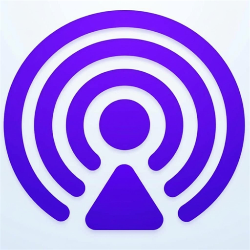

# Local Transfer

<p align="center">
  
</p>

<h3 align="center">Next-Generation Secure Local File Sharing with Liquid Glass Aesthetics </h3>

<p align="center">
  <b>Developed & Maintained by <a href="https://github.com/smartworldarafath">Arafath</a></b>
</p>

<p align="center">
  
  
  
  
</p>

---

## 🌟 Overview

**Local Transfer** is a high-performance, cross-platform file sharing and messaging application that enables instant, secure data transfer across nearby devices on your local network—**with zero internet connection, zero third-party cloud servers, and zero speed throttling**.

Built on a hybrid architecture combining a high-speed **Rust protocol core** with a fluid **Flutter UI**, Local Transfer features a cutting-edge **Liquid Glass optical refraction design system** for unprecedented visual elegance and responsiveness.

---

## ✨ Key Features & Enhancements

### 💎 Liquid Glass Optical Physics System
- **Snell's Law Light Refraction ($n = 1.50$):** High-fidelity glass simulation that dynamically bends and distorts underlying interface layers according to authentic crown-glass optical formulas.
- **Physical Specular Meniscus Bevel:** Realistic directional light highlights (135° angle, 0.75 base intensity, 11dp optical thickness) creating depth and organic glass curvature.
- **Integrated AGSL & Java Engine:** Android 13+ (API 33+) native `RuntimeShader` integration paired with custom Flutter shader fallback pipelines.
- **Transformed UI Elements:**
  - **Floating Liquid Glass Navigation Dock:** Sleek bottom dock with fluid spring-animated active indicator pill for switching between *Receive*, *Send*, and *Settings*.
  - **Quick Action Grid:** Glass-morphic action tiles for *File*, *Media*, *Paste*, *Text*, *Folder*, and *App*.
  - **Interactive Action Buttons:** Tactile fluid press states with haptic micro-feedback on *Add*, *Receive via link*, *Fix automatically*, and *Open Firewall*.

### ⚡ Smooth High-Performance Experience
- **Fluid Spring Physics:** Micro-tuned cubic Bezier and spring curves (120ms–250ms response windows) eliminate micro-stutter and frame drops during navigation and touch interactions.
- **Decoupled Background Networking:** All heavy cryptography, chunk streaming, and socket operations run on independent background isolates and native Rust threads, keeping the UI thread smooth and responsive.

### 🔒 Enterprise-Grade Local Security & Privacy
- **End-to-End TLS Encryption:** Every session generates on-the-fly X.509 certificates with mandatory mutual client certificate verification (SHA-256 fingerprint matching).
- **100% Local Communication:** Transfers occur directly peer-to-peer via local Wi-Fi or hotspot. No telemetry, no external server tracking, and no cloud middlemen.
- **PIN Authentication:** Optional receiving and browser PIN security for restricted environments.

### 🚀 High-Speed Multi-Threaded Transfer
- **Rust Protocol Engine:** Leverages asynchronous Rust (`tokio`, `hyper`, `ring`) for maximum network throughput and minimal CPU overhead.
- **Multi-Device Discovery:** Zero-configuration UDP multicast discovery (v2.2 protocol) instantly detects active peers on both IPv4 and IPv6 link-local subnets.
- **Receive via Link (Web Share):** Built-in local HTTP server allowing any device with a web browser (Smart TVs, legacy OS, iOS/Android devices without the app) to download files directly.
- **Favorite Devices & History:** Save trusted devices for one-tap sharing and review detailed transfer receipts.

---

## 🏗️ Architecture

Local Transfer uses a modern multi-layer architecture separating business logic, protocol execution, and visual rendering:

```
┌────────────────────────────────────────────────────────┐
│                   Flutter UI (App)                     │
│    Refena State Management • Liquid Glass Design       │
│    Animation Controllers • Slang i18n                │
└───────────────────────────┬────────────────────────────┘
                            │ Method Channels / FRB
┌───────────────────────────▼────────────────────────────┐
│              localsend_isolates Package                │
│    Dart Background Isolates • flutter_rust_bridge      │
└───────────────────────────┬────────────────────────────┘
                            │ Native FFI
┌───────────────────────────▼────────────────────────────┐
│                    Rust Core Engine                    │
│    HTTP/HTTPS Protocol v2 • UDP Multicast v2.2         │
│    Streaming Crypto • Web Share Server                 │
└────────────────────────────────────────────────────────┘
```

---

## 📥 Download & Installation

The compiled release APK is ready for installation:

- **Location:** `C:\Users\Fahad\Downloads\Generated APK\Local\LocalTransfer.apk`
- **Package ID:** `org.localsend.localsend_app`
- **Target SDK:** Android 36 / 37
- **Min SDK:** Android 24 (Nougat)

---

## 🛠️ Building from Source

### Prerequisites
- **Flutter:** 3.47.x (or pinned via `.fvmrc`)
- **JDK:** OpenJDK 17 (`JAVA_HOME`)
- **Android SDK:** API 34+ with NDK `28.2.13676358`
- **Rust:** Stable toolchain (`x86_64-pc-windows-gnu` / MSVC with target triples `aarch64-linux-android`, `armv7-linux-androideabi`, `x86_64-linux-android`)

### Build Steps

```bash
# 1. Clone repository
git clone https://github.com/smartworldarafath/Local-Transfer.git
cd Local-Transfer

# 2. Get dependencies
flutter pub get

# 3. Build release APK
cd app
flutter build apk --release --android-skip-build-dependency-validation
```

---

## 👨‍💻 Developer & Credits

- **Developer:** [Arafath](https://github.com/smartworldarafath)
- **Original Base Project:** [LocalSend](https://github.com/localsend/localsend) by Tien Do Nam
- **Liquid Glass Physics:** Based on Snell's Law Optical Refraction & AGSL Runtime Shader implementations.

---

## 📄 License

This project is licensed under the [MIT License](LICENSE).
